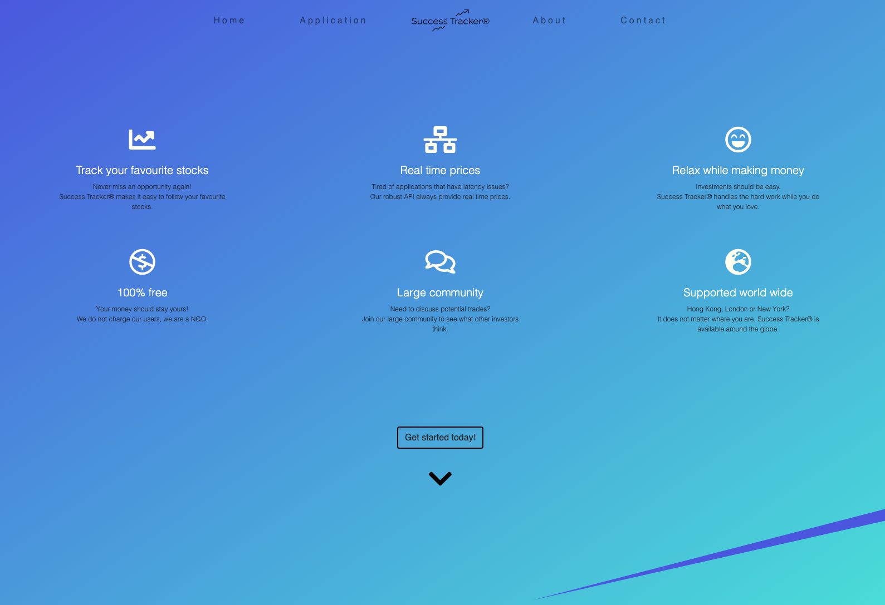
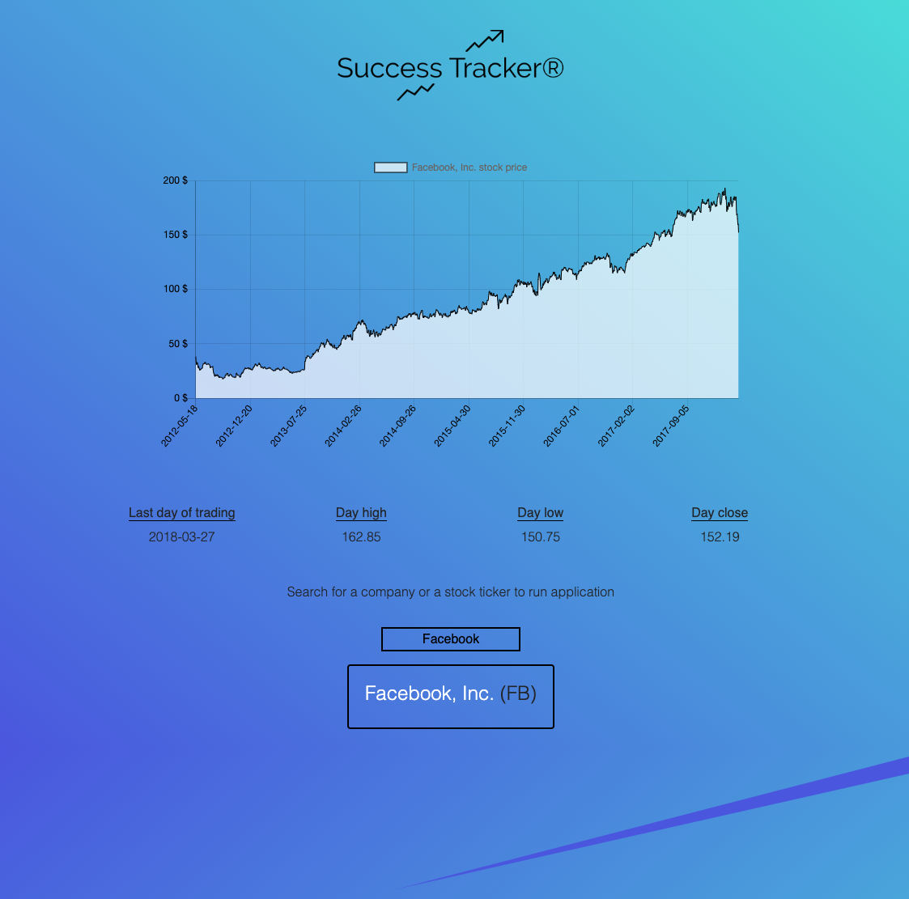
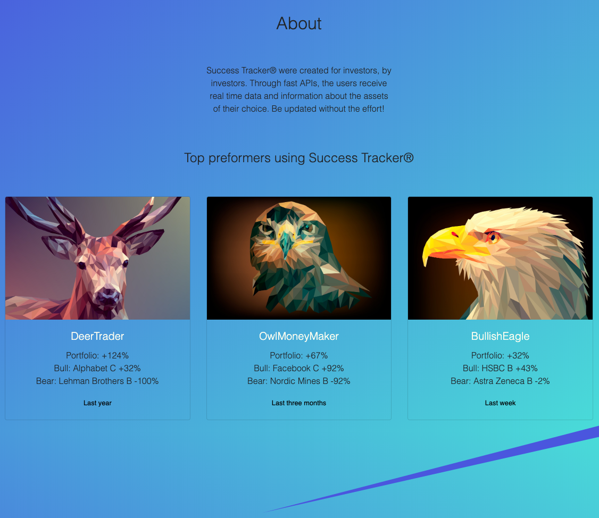
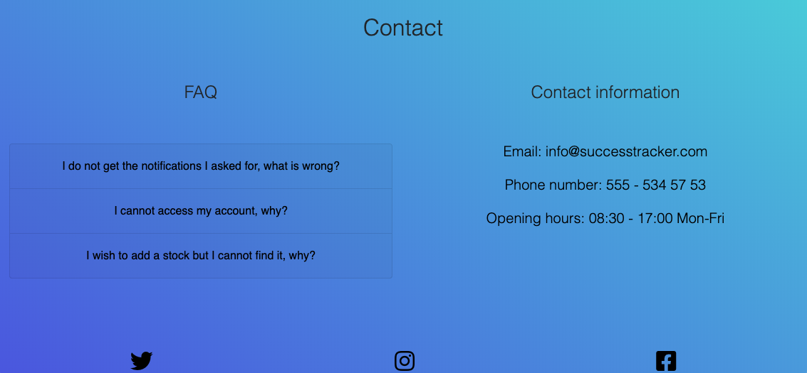

<h1 align="center">

  
</h1>

[View this website on GitHub Pages](https://astromerik.github.io/milestone2/) 

Success Tracker is an application for investors. The web application is presented on a single page website which includes a home section, application section, about section and a contact/faq section. 

The web application (Success Tracker) was built to display information about stocks in a clear and easy way. Investors who want instant information regarding the stock of their choice are able to not only get the data presented, but also get it visualized. 
The main effort was put on making the application user firendly. Too many similar applications are complex and are difficult to use and understand the first times. Success Tracker povides the user to find the information they need with one click. 
The website it self is aimed to deliver a good user experience and also taking a stab at proving that gradiant coloring is coming back. 

The goal for this application: 
* Fetch stock data from an external API (quandl API)
* Present relevant stock information for the user in an intuitive way
* Create an interactive application where user face different data depending on user input

The users goals are:
* Easily analyse their favourite stocks 
* Get the wanted information fast 

## UX

#### Ideal users are:
* English speaking
* Investors who have a basic understanding about the stock market
* Investors who want a simpel-to-use application 

#### Users are searching for:
* An application which can provide them with instant stock data
* User friendly analytic tool 

#### This website make it easy for the user to search for stock information because:
* It is intuitive and easy to navigate 
* It is clean, without unnecessary features or information
* The application (Success Tracker) have limited user options, which makes it intuitive 
* If questions occur, the FAQ section answer the most common questions
* If questions occur, it is easy to get in contact with the developer/team

#### User stories
1. As a new visitor to the website, I want instant information of what the application/website can provide
2. As a new visitor to the website, I want it to be easy to navigate through the different sections
3. As a new visitor to the website, I want the application to be intuitive and easy to use
4. As a returning visitor to the website, I want updated stock information when using the application
5. As an investor, I want relevant stock information 
6. As an investor, I want to discover potenital stocks to invest in, thus, change between companies in a easy way

#### Balsamiq mockups
To view the initial wireframes for the application/website, click <a href="assets/Mockups/mockups.pdf" target="_blank">here</a>

The wireframes display all the sections on the website, for both desktop and mobile view. The sections are:
* Home section
* Application section
* About section
* Contact section 

## Features

#### Navigation bar and footer 

The website contains a navbar on the top of the page which display the sites sections and the Success Tracker logo. The navbar collapses when the screen size is less than 992 pixels (tablet mode), only showing the logo and a hamburger menu. 
The navbar is not fixed, either on big or small screen sizes. This is because we do not want the navbar to take uncessary space. This is not a problem since the website is short in terms of sections and thus easy to navigate through even without the navbar. However, in order to make the site as user friendly as possible, this option will be considered again shortly. 
When clicking the hamburger menu, the menu colappses and display the different sections which the user to click on to be directed to the section of choice. 
The footer, on the bottom of the page, is kept as minimalistic as possible and only contains icons to the social platforms Success Tracker present on. 

#### Home
 
The home page displays icons with reasons why the visitor should start using Success Tracker. The statements are uses as a selling point and is currently not interactive. 
The home page is kept clean to give the visitor the right impression (that the application is easy to use). On the bottom of the home page there is a button with the text "Get started today!" and when clicked it takes to user to the application section.

#### Application

The application section is where the user finds the application. The application (Success Tracker®) is the hart of the website. 
On top of the section, the Success Tracker® logo is displayed. Below it, the actual application is hidden at first, only showing the message that describe what the user must do to run it. 
The text box/search field is displayed under the application. When the user enters a letter they see a list with only the companies or tickers that matches the unput. The more letters the user put into the search field the more precise the search will be. 
To start the application the user click on one of the options that is displayed. This activates the API and fetches the requested information based on the input. 
During the loading time, the user is presented with a loading gif-file so the user understands that a process is running. When the process is completed a graph displays the stock price history. When the user hover the mouse over the black line on the graph (highest stock price of the day) a box pops up and displays the date and price. Beneath the graph, the user will be presented with the last day of trading, the highest price of the day, the lowest price of the day and the closing price. 
If the user want to search for a new stock, the user simply delets the text in the input field and search for a new stock/company. They will now see that the list will be uppdated as expected and the filtering process continues as previously (when adding more text). 

#### About

The about section start with a short message regarding who built the application and whom its aimed towards. It is also describing the application in a short sentence. 
Below the text a presentation (for now fictional) of the current highest performing users is displayed. It shows a highlight of the best perfomers portfoilos over the last week, 3 months and year. 
This is again, a marketing tactic to show that the application is for thoes who wants to succeed with their investments. 

#### Contact

The contact section contains a FAQ part and a contact information part. 
The FAQ part contains a drop down menu with the most frequently asked questions. When a question is being clicked, the answer is displayed below it. 
To the right of the FAQ section, the user finds the contact information (email, phone number and opening hours). 

### Exisiting features

* Navigation bar - When clicked on one of the options, the user is directed to the selected section
* Hamburger menu - When clicked, a dropdown display the navigation bar content and the process is the same as above
* Search field for companies/stocks - List displaying companies/stocks that filters depending on the users input
* Graph - Graph that displays the fetched stock prices and dates from the api. Based on user input. Users can hover mouse over grapph to get information about the specific date/price.
* Stock information - Beneath the graph, stock information is presented, which is fetched from api and based on user input. 
* FAQ boxes - Drop down functionality for FAQ boxes. 

### Feauters left to implement
* A error message for the user if they search for a company which does not exist in the api. 
* Updated the list which matches the search field and the api. 
* For the application to be more comprehensive, a larger api will be used. This is needed to be able to display P/E-value, Market Cap, compare to industries and indexes etc. Also, if real time prices is wanted a better API is needed. 
* Login page for users to save their history.
* Forum for users to discuss shares. 
* Notification functionality so that users can trach their stocks without actually using the application. (email sent when stock hit a price etc.)

## Technologies used

* The website was built using HTML5 and CSS3. 
* JavaScript was used to build an interactive webpage and to connect to an API.
* [jQuery](https://jquery.com/) was use to make DOM manipulation easier.
* To make the structure and the site responsive in a simple manner [Bootstrap](https://getbootstrap.com/) were used.
* An API from [Quandl](https://www.quandl.com/databases/WIKIP/documentation) was used to fetch stock data. 
* To create a JSON-file, matching company names and tickers, data from [nasdaqdata](https://nasdaqdata.com) were used. 
* To display the stock data in a timeline (graph) format, [ChartJS](https://www.chartjs.org/) were used. 
* The website as built and developed using [GitPod](https://www.gitpod.io/) as IDE.
* Icons was collected using [FontAwesome](https://fontawesome.com/start).
* The fonts used on the website was collected through [Google Fonts](https://fonts.google.com/).
* The logotype was created using [LogoMakr](https://logomakr.com).
* To design the "section breakers" on the page [vectr](https://vectr.com/) were used.
* [W3C's HTLM Validator](https://validator.w3.org/) were used to validate the websites HTML code. 
* [W3C's CSS Validator](https://validator.w3.org/) were used to validate the websites CSS code. 
* [JSHint](https://jshint.com/) were used to validate the websites JavaScript code. 

## Testing

There are two current issues with the applications that are well known and will be focused on in the near future. These two are: 
* Companies/stocks that shows as an example but do not exist in the API - This is because the API itself did not provide any company names (only 3 000+ tickers). To display the company names for the user, a separate list needed to be created. 
The problem is that the API have no information regarding what lists/indexes the tickers can be found, thus the developer decided to take the 4 000 biggest companies/listed stocks in the US and create a JSON file from this. Therefore, the user can find companies/stocks that cannot be displayed since it cannot be found in the APi. 
The JSON-file will be updated moving forward. 

* The user is not notified about above problem and only sees the loading gif - As of today, there is no error message displaying when the user send a request for a company that do not exist in the api. This will be the main focus to develop in the next stage. 

For a in depth walkthrough of the testing done on the website see [Testing.md](#) 

## Deployment

As mentioned, [GitPod](https://www.gitpod.io/) was used as IDE when developing this application. Throug out the development, the project was commited to the git and continuously pushed to GitHub. 
The following steps were taken to deploy the application:
1. Log into my GitHub user. 
2. Chosing the repository "Milestone2"
3. When entering the repository, clicking "Settings" which is found on the top right. 
4. When entering "Settings", scroll down to Github pages section and change "Source" to "Master Branch".
5. Reload the page and scroll down to the same section - click the link and... Voila! The page is deployed. 

## Credits

### Content 
* My girlfriend, Marie-Sofie Persson, gave input on the page layout and design.  

### Media
* All images used in the webpage was collected from [Pixabay](https://pixabay.com) and especially from the artist [Manuchi](https://pixabay.com/users/manuchi-1728328/)
* Icons was collected using [FontAwesome](https://fontawesome.com/start).
* The logotype was created using [LogoMakr](https://logomakr.com).
* To design the "section breakers" on the page [vectr](https://vectr.com/) were used.
* To display the stock data in a timeline (graph) format, [ChartJS](https://www.chartjs.org/) were used. 

### Code
* Inspiration for the filtering process and search functionality in the application was gathered from [Traversy_Media](https://www.youtube.com/user/TechGuyWeb) on Youtube.

### Acknowledgements
* A big thank you to my tutors at Code Institute for helping me along the way. 
* Also a big thank you to my mentor Brian Macharia for all great feedback and for taking the time to help me(even during a friday night). 